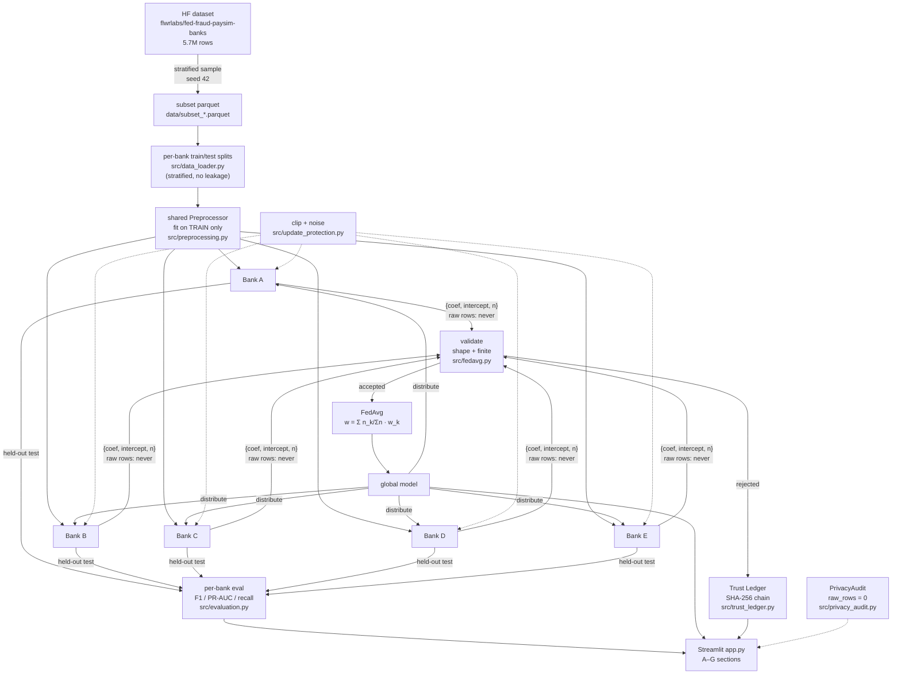

# CIPHERMESH architecture

```mermaid
flowchart TD
    HF["HF dataset<br/>flwrlabs/fed-fraud-paysim-banks<br/>5.7M rows"] -->|stratified sample<br/>seed 42| SUB["subset parquet<br/>data/subset_*.parquet"]
    SUB --> SPLIT["per-bank train/test splits<br/>src/data_loader.py<br/>(stratified, no leakage)"]
    SPLIT --> PRE["shared Preprocessor<br/>fit on TRAIN only<br/>src/preprocessing.py"]
    PRE --> BA["Bank A"] & BB["Bank B"] & BC["Bank C"] & BD["Bank D"] & BE["Bank E"]
    BA & BB & BC & BD & BE -->|"{coef, intercept, n}<br/>raw rows: never"| VAL["validate<br/>shape + finite<br/>src/fedavg.py"]
    VAL -->|rejected| LED["Trust Ledger<br/>SHA-256 chain<br/>src/trust_ledger.py"]
    VAL -->|accepted| AVG["FedAvg<br/>w = Σ n_k/Σn · w_k"]
    AVG --> GLOB["global model"]
    GLOB -->|distribute| BA & BB & BC & BD & BE
    BA & BB & BC & BD & BE -->|held-out test| EVAL["per-bank eval<br/>F1 / PR-AUC / recall<br/>src/evaluation.py"]
    EVAL --> DASH["Streamlit app.py<br/>A–G sections"]
    GLOB --> DASH
    LED --> DASH
    CLIP["clip + noise<br/>src/update_protection.py"] -.-> BA & BB & BC & BD & BE
    AUD["PrivacyAudit<br/>raw_rows = 0<br/>src/privacy_audit.py"] -.-> DASH
```

Only numeric parameters cross the bank→coordinator boundary. Raw `DataFrame`s never do —
enforced by function signatures and covered by `tests/test_privacy_audit.py`.
